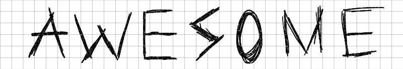

# Awesome reMarkable 

# [
](https://github.com/sindresorhus/awesome)

The [reMarkable](https://www.remarkable.com) is a paper tablet for those who prefer writing on paper, rather than keyboards. Its remarkably fast paper-white display, Linux based operating system and awesome community make it highly attractive amongst hackers and developers.

*Contributions are welcome as long as they follow the [guidelines](CONTRIBUTING.md).*

## Contents

- [APIs](#apis)
- [Applications](#applications)
- - [Games](#games)
- - [Launchers](#launchers)
- [Cloud Tools](#cloud-tools)
- [Device Tools](#device-tools)
- [GUI Clients](#gui-clients)
- [Other](#other)
- [Screen Sharing/Streaming](#screen-sharingstreaming)

## APIs

- [google-drive-remarkable-sync](https://github.com/bsdz/google-drive-remarkable-sync) - Apps Script API for reMarkable Cloud. Includes Synchronizer capability to automate mirroring of documents from Google Drive to reMarkable Cloud.
- [jrmapi](https://github.com/jlarriba/jrmapi) - A Java API for the reMarkable Cloud.
- [libreMarkable](https://github.com/canselcik/libremarkable) - A framework for developing applications with native refresh support for reMarkable Tablet.
- [lines-are-beautiful](https://github.com/ax3l/lines-are-beautiful) - C++ File API for the reMarkable tablet.
- [lines-are-rusty](https://github.com/ax3l/lines-are-rusty) - Rust File API for the reMarkable tablet.
- [fc-rM](https://github.com/artagnon/FreelyCommute/tree/master/rM) - C++ Parser for the .rM v5 format.
- [reMarkableAPI](https://github.com/splitbrain/ReMarkableAPI) - Docs and implementation of the reMarkable file sync API.
- [reMarkable-layers](https://github.com/bsdz/remarkable-layers) - Python API for reading & writing reMarkable Lines format. Supports very basic conversion of PDFs and SVGs to Lines format. 
- [reMarkable-typescript](https://github.com/Ogdentrod/reMarkable-typescript) - TypeScript API for reMarkable Cloud.
- [rMAPI](https://github.com/juruen/rmapi) - ReMarkable Cloud Go API.
- [rmapy](https://github.com/subutux/rmapy) - ReMarkable Cloud Python API.
- [rmfakecloud](https://github.com/ddvk/rmfakecloud) - Fake Cloud Sync, server implementation of the Cloud API.

## Applications

- [harmony](https://rmkit.dev/apps/harmony) - a low latency sketching app with procedural brushes.
- [KOReader](https://github.com/koreader/koreader) - An ebook reader application supporting PDF, DjVu, EPUB, FB2 and many more formats.
- [plato](https://github.com/darvin/plato) - Plato reader port. Supports pdfs, epubs, many other formats.
- [reMarkable keywriter](https://github.com/dps/remarkable-keywriter) - A distraction free keyboard notes app.
- [reMarkable wikipedia](https://github.com/dps/remarkable-wikipedia) - Offline wikipedia reader for reMarkable.

### Games

- [chessMarkable](https://github.com/LinusCDE/chessmarkable) - Play chess against a bot or a friend.
- [minesweeper](https://rmkit.dev/apps/minesweeper) - A mine detection game.
- [retris](https://github.com/LinusCDE/retris) - Play a clone of the popular block stacking game with either buttons or swipe guestures.

### Launchers

- [draft-reMarkable](https://github.com/dixonary/draft-reMarkable) - A launcher for the reMarkable tablet, which wraps around the standard interface.
- [oxide](https://github.com/Eeems/oxide/releases) - A launcher application for the reMarkable tablet.
- [remux](https://rmkit.dev/apps/remux) - A multi-tasking launcher for the reMarkable tablet.

## Cloud Tools

- [CUPS Printing](https://ofosos.org/2018/10/22/printing-to-remarkable-cloud-from-cups/) - Script to print directly to reMarkable Cloud from CUPS using rMAPI.
- [rM-sync](https://github.com/simonschllng/rm-sync) - Sync script for reMarkable paper tablet.
- [reMarkable_syncthing](http://github.com/evidlo/remarkable_syncthing) - Syncthing on reMarkable.
- [zotero-reMarkable](https://github.com/michaelmior/zotero-remarkable) - Script to sync PDFs from the [Zotero](https://www.zotero.org/) reference manager.
- [sync_zotero_remarkable](https://github.com/danijoo/sync_zotero_remarkable) - Sync PDFs from Zotero to Remarkable.

## GUI Clients

- [asTounding](https://github.com/jlarriba/astounding) -  A multiplatform GUI application for the reMarkable cloud, including Linux.
- [RemaDroid](https://play.google.com/store/apps/details?id=org.remadroid) - An alternative Android app to upload documents, webpages or images to the reMarkable tablet.
- [RemaPy](https://github.com/peerdavid/remapy) - GUI to browse, download/upload files and backup the tablet (also on Linux) using the cloud.
- [reMarkable-assistant](https://github.com/richeymichael/remarkable-assistant) - Manage templates, splash screens, and settings on your reMarkable tablet.
- [reMarkable Connection Utility (RCU)](http://www.davisr.me/projects/rcu/) - A cross-platform client for offline management of backups, screenshots, notebooks, templates, wallpaper, and third-party software.
- [reMarkable-hyutilities](https://github.com/moovida/remarkable-hyutilities) - A GUI written in java to backup your device, upload templates and modify splash screens.
- [ReMy](https://github.com/bordaigorl/remy) - A GUI to browse, preview documents, export documents with custom settings, all via SSH (no cloud needed); works from local raw backups too.
- [rMExplorer](https://github.com/bruot/pyrmexplorer/wiki) - GUI to browse, download/upload files and backup the tablet without using the cloud.
- [rmUploader](https://github.com/lobre/rmuploader) - Simple web app to upload epub or pdf files to the reMarkable tablet via drag and drop.

## Other

- [Crazy Cow](https://github.com/machinelevel/sp425-crazy-cow) - Typewriter input from USB keyboard directly into reMarkable interface.
- [Funcky reMarkable Exporter](https://github.com/simonbaudart/Funcky.Remarkable.Exporter) - Export notes from a reMarkable Tablet to File System and External Services.
- [Goosepaper](https://github.com/j6k4m8/goosepaper): Deliver prettily-formatted RSS feeds, news articles, Wikipedia articles-of-the-day, and more to your reMarkable tablet.
- [instapaper-as-pdf-to-reMarkable](https://github.com/fabianmu/instapaper-as-pdf-to-remarkable) - Export Instapaper-Articles to PDF and send them to a connected rM tablet.
- [morningpaper2reMarkable](https://github.com/jessfraz/morningpaper2remarkable) - A bot to sync the morning paper to a remarkable tablet.
- [paper2reMarkable](https://github.com/GjjvdBurg/paper2remarkable) - Download an academic paper or HTML article, crop it, and send it to the reMarkable with a single command.
- [Parabola-rM](http://www.davisr.me/projects/parabola-rm/) - A Desktop GNU/Linux-libre replacement OS with fast partial refreshing and USB OTG.
- [pocket2rm](https://github.com/glidergeek/pocket2rm) - Synchronize articles from read-later platform pocket in PDF and epub.
- [reHackable/maxio](https://github.com/reHackable/maxio) - Companion daemon for the reMarkable paper tablet.
- [reHackable/scripts](https://github.com/reHackable/scripts) - A set of bash scripts that may enhance your reMarkable experience.
- [reMarkable_entware](http://github.com/evidlo/remarkable_entware) - Package manager for reMarkable.  Install common Unix utilities through the command line.
- [reMarkable_keyboard](https://github.com/Evidlo/remarkable_keyboard) - Software to use rM as wireless keyboard/mouse.
- [reMarkable_mouse](https://github.com/evidlo/remarkable_mouse) - Use your reMarkable as a graphics tablet.
- [remarkable_news](https://github.com/evidlo/remarkable_news) - Use daily news/comics/images as the suspend screen.
- [reMarkable_pdflets](https://github.com/evidlo/remarkable_pdflets) - Dynamically updating PDFs.
- [remarkable_printer](https://github.com/Evidlo/remarkable_printer) - Print from any device to reMarkable without browser extensions or reMarkable cloud.
- [reMarkable-fs](https://github.com/nick8325/remarkable-fs) - A FUSE filesystem wrapper for the reMarkable tablet.
- [reMarkable-random-screens](https://github.com/Neurone/reMarkable) - Change your poweroff and suspend screens every 5 minutes with random images of your choice
- [reMarkable-touchgestures](https://github.com/ddvk/remarkable-touchgestures) - Touch gestures (swipe/touch) for easy page navigation.
- [reMarkable-tweak](https://github.com/morngrar/remarkable-tweak) - Tweak tool for the reMarkable paper tablet. Lets you organize your templates with no fuss.
- [remarks](https://github.com/lucasrla/remarks) - Extract highlights, scribbles, and annotations from PDFs. Export to Markdown, PNG, and SVG.
- [remt](https://gitlab.com/wrobell/remt) - reMarkable tablet command-line tools.
- [rM-dl-annotated](https://github.com/jmptable/rm-dl-annotated) - Export annotated PDFs from reMarkable tablets.
- [rMsync](https://github.com/lschwetlick/rMsync) - Synchronisation script with a local dedicated "library" folder.
- [rmTabletDriver](https://github.com/LinusCDE/rmTabletDriver) - Application that allows you to simulate/clone rM input on your computer.
- [rmWacomToMouse](https://github.com/LinusCDE/rmWacomToMouse) - Use the wacom pen as a mouse to draw on your pc.
- [rmWebUiTools](https://github.com/LinusCDE/rmWebUiTools) - View a file tree, see statistics and export/backup all files with some simple scripts utilizing the web ui.

## Screen Sharing/Streaming

- [reStream](https://github.com/rien/reStream) - Stream your reMarkable screen over SSH.
- [rMview](https://github.com/bordaigorl/rmview) - A fast GUI to stream your reMarkable screen over vanilla-SSH or VNC.
- [rM-vnc-server](https://github.com/peter-sa/rM-vnc-server) - A fast & efficient damage-tracking (sending only updated regions) VNC server for streaming the reMarkable's screen.
- [srvfb](https://github.com/merovius/srvfb) - Alternative screen-streaming software. Written in Go.
- [VNSee](https://github.com/matteodelabre/vnsee) - VNC client for the reMarkable tablet allowing you to use the device as a second screen.
